```{r setup, include = FALSE}
knitr::opts_chunk$set(echo = FALSE,message=FALSE,warning=FALSE)
library(tidyverse)
library(gridExtra)
library(here)
library(egg)
# library(citr)
```


```{=tex}
\newpage
\blandscape
```

```{=tex}
\elandscape
```

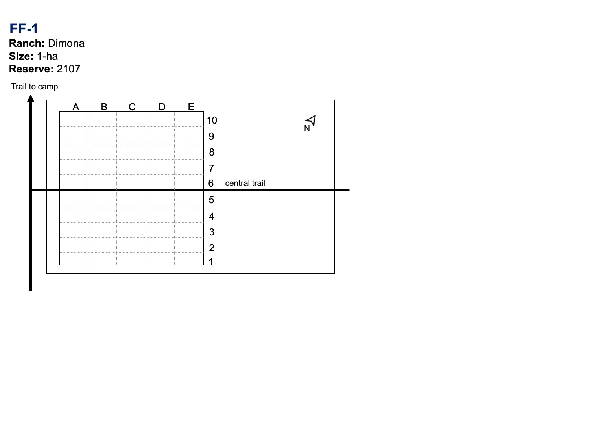{width=90%}  

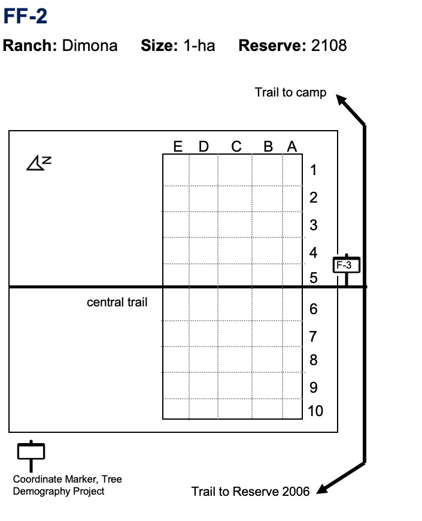{width=90%}  

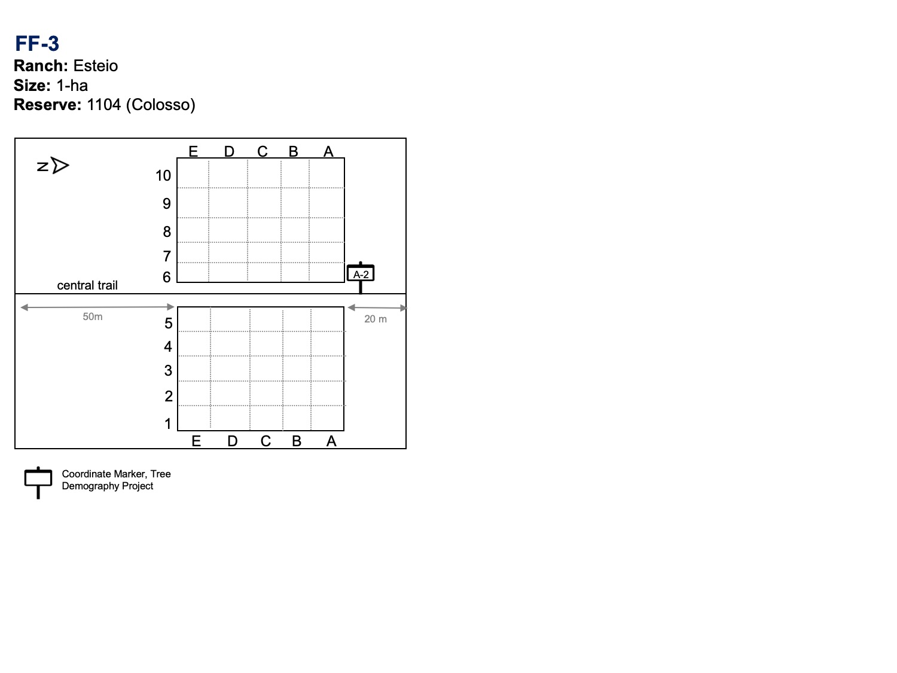{width=90%}  

{width=90%}  

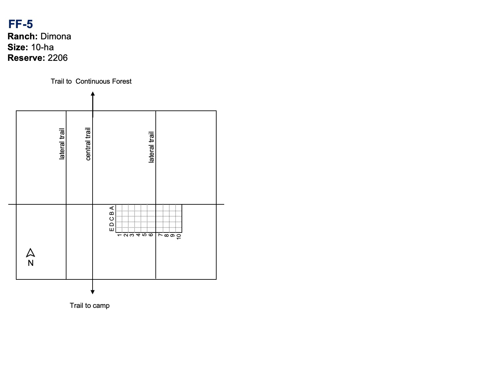{width=90%}  

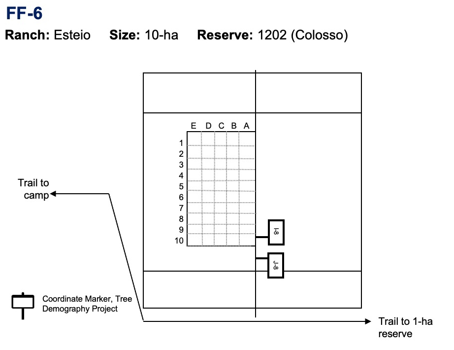{width=90%}  

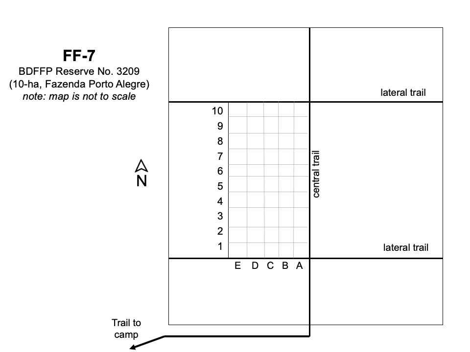{width=90%}  

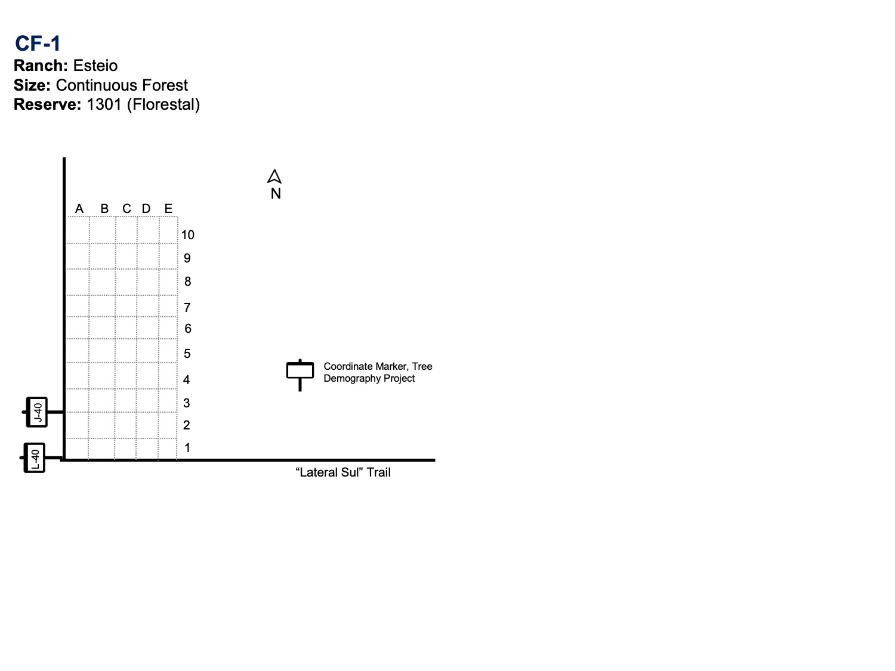{width=90%}  

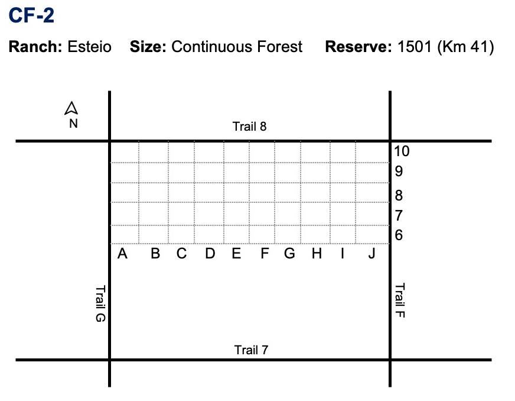{width=90%}  

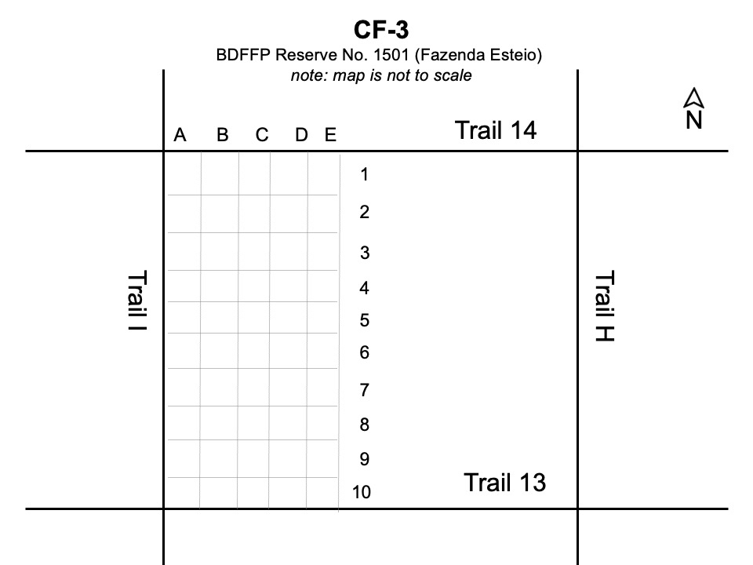{width=90%}  

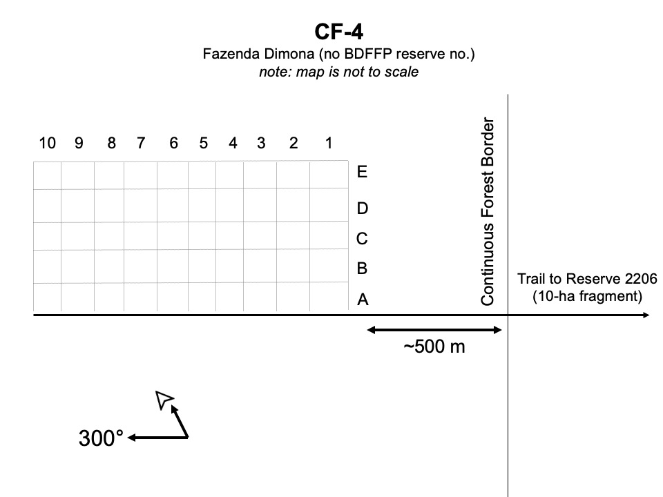{width=90%}  

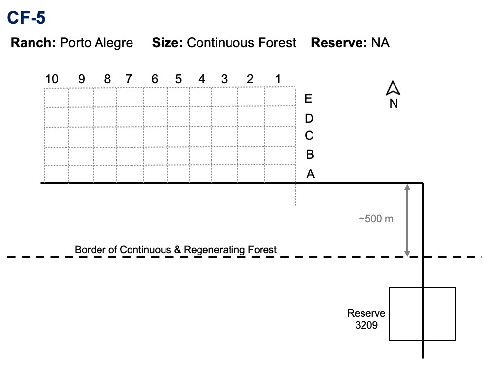{width=90%}  

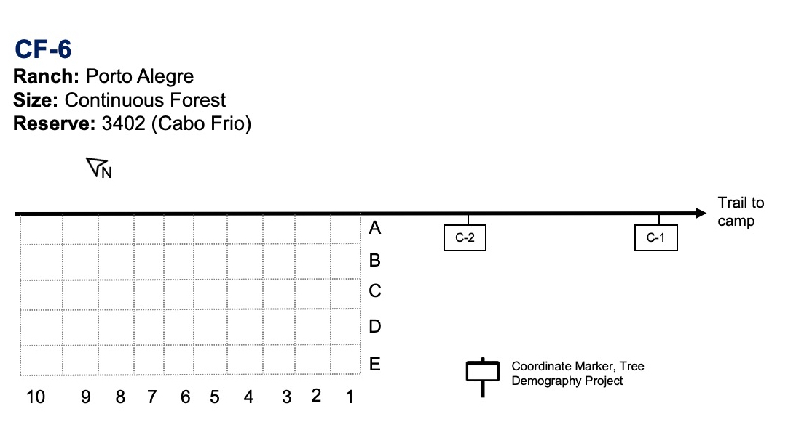{width=90%}  


