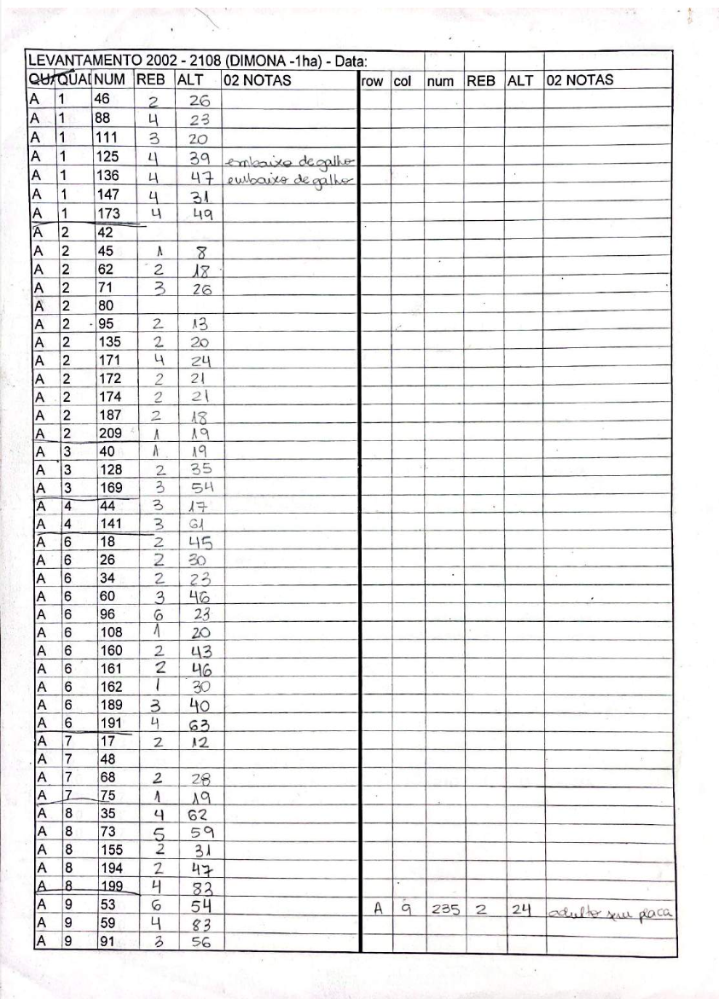

# Survey Datasheets

Scanned copies (.pdf format) of the original datasheets used to record data from the demographic surveys are now available for review and download.

------------------------------------------------------------------------

| Category          | Plot        | Survey Year                                                      |
| -------- | ------- | ------- |
| **1-ha fragment**     | FF-1        | [1999](../survey_datasheets/frag-one/ff1-2107/ff1-2107-1999.pdf) \| [2000](../survey_datasheets/frag-one/ff1-2107/ff1-2107-2000.pdf) \| [2001](../survey_datasheets/frag-one/ff1-2107/ff1-2107-2001.pdf) \| [2002](../survey_datasheets/frag-one/ff1-2107/ff1-2107-2002.pdf) \| [2003](../survey_datasheets/frag-one/ff1-2107/ff1-2107-2003.pdf) \| [2004](../survey_datasheets/frag-one/ff1-2107/ff1-2107-2004.pdf) \| [2005](../survey_datasheets/frag-one/ff1-2107/ff1-2107-2005.pdf) \| [2006](../survey_datasheets/frag-one/ff1-2107/ff1-2107-2006.pdf) \| [2007](../survey_datasheets/frag-one/ff1-2107/ff1-2107-2007.pdf) \| [2008](../survey_datasheets/frag-one/ff1-2107/ff1-2107-2008.pdf) \| [2009](../survey_datasheets/frag-one/ff1-2107/ff1-2107-2009.pdf)            | 
|                   | FF-2        | [1999](../survey_datasheets/frag-one/ff2-2108/ff2-2108-1999.pdf) \| [2000](../survey_datasheets/frag-one/ff2-2108/ff2-2108-2000.pdf) \| [2001](../survey_datasheets/frag-one/ff2-2108/ff2-2108-2001.pdf) \| [2002](../survey_datasheets/frag-one/ff2-2108/ff2-2108-2002.pdf) \| [2003](../survey_datasheets/frag-one/ff2-2108/ff2-2108-2003.pdf) \| [2004](../survey_datasheets/frag-one/ff2-2108/ff2-2108-2004.pdf) \| [2005](../survey_datasheets/frag-one/ff2-2108/ff2-2108-2005.pdf) \| [2006](../survey_datasheets/frag-one/ff2-2108/ff2-2108-2006.pdf) \| [2007](../survey_datasheets/frag-one/ff2-2108/ff2-2108-2007.pdf) \| [2008](../survey_datasheets/frag-one/ff2-2108/ff2-2108-2008.pdf) \| [2009](../survey_datasheets/frag-one/ff2-2108/ff2-2108-2009.pdf)            | 
|                   | FF-3        | [1999](../survey_datasheets/frag-one/ff3-1104/ff3-1104-1999.pdf) \| [2000](../survey_datasheets/frag-one/ff3-1104/ff3-1104-2000.pdf) \| [2001](../survey_datasheets/frag-one/ff3-1104/ff3-1104-2001.pdf) \| [2002](../survey_datasheets/frag-one/ff3-1104/ff3-1104-2002.pdf) \| [2003](../survey_datasheets/frag-one/ff3-1104/ff3-1104-2003.pdf) \| [2004](../survey_datasheets/frag-one/ff3-1104/ff3-1104-2004.pdf) \| [2005](../survey_datasheets/frag-one/ff3-1104/ff3-1104-2005.pdf) \| [2006](../survey_datasheets/frag-one/ff3-1104/ff3-1104-2006.pdf) \| [2007](../survey_datasheets/frag-one/ff3-1104/ff3-1104-2007.pdf) \| [2008](../survey_datasheets/frag-one/ff3-1104/ff3-1104-2008.pdf) \| [2009](../survey_datasheets/frag-one/ff3-1104/ff3-1104-2009.pdf)            | 
|                   | FF-4        | [1999](../survey_datasheets/frag-one/ff4-1301/ff4-1301-1999.pdf) \| [2000](../survey_datasheets/frag-one/ff4-1301/ff4-1301-2000.pdf) \| [2001](../survey_datasheets/frag-one/ff4-1301/ff4-1301-2001.pdf) \| [2002](../survey_datasheets/frag-one/ff4-1301/ff4-1301-2002.pdf) \| [2003](../survey_datasheets/frag-one/ff4-1301/ff4-1301-2003.pdf) \| [2004](../survey_datasheets/frag-one/ff4-1301/ff4-1301-2004.pdf) \| [2005](../survey_datasheets/frag-one/ff4-1301/ff4-1301-2005.pdf) \| [2006](../survey_datasheets/frag-one/ff4-1301/ff4-1301-2006.pdf) \| [2007](../survey_datasheets/frag-one/ff4-1301/ff4-1301-2007.pdf) \| [2008](../survey_datasheets/frag-one/ff4-1301/ff4-1301-2008.pdf) \| [2009](../survey_datasheets/frag-one/ff4-1301/ff4-1301-2009.pdf)            | 
| **10-ha fragment**    | FF-5        | [1999](../survey_datasheets/frag-ten/ff5-2206/ff5-2206-1999.pdf) \| [2000](../survey_datasheets/frag-ten/ff5-2206/ff5-2206-2000.pdf) \| [2001](../survey_datasheets/frag-ten/ff5-2206/ff5-2206-2001.pdf) \| [2002](../survey_datasheets/frag-ten/ff5-2206/ff5-2206-2002.pdf) \| [2003](../survey_datasheets/frag-ten/ff5-2206/ff5-2206-2003.pdf) \| [2004](../survey_datasheets/frag-ten/ff5-2206/ff5-2206-2004.pdf) \| [2005](../survey_datasheets/frag-ten/ff5-2206/ff5-2206-2005.pdf) \| [2006](../survey_datasheets/frag-ten/ff5-2206/ff5-2206-2006.pdf)            | 
|                   | FF-6        | [1999](../survey_datasheets/frag-ten/ff6-1202/ff6-1202-1999.pdf) \| [2000](../survey_datasheets/frag-ten/ff6-1202/ff6-1202-2000.pdf) \| [2001](../survey_datasheets/frag-ten/ff6-1202/ff6-1202-2001.pdf) \| [2002](../survey_datasheets/frag-ten/ff6-1202/ff6-1202-2002.pdf) \| [2003](../survey_datasheets/frag-ten/ff6-1202/ff6-1202-2003.pdf) \| [2004](../survey_datasheets/frag-ten/ff6-1202/ff6-1202-2004.pdf) \| [2005](../survey_datasheets/frag-ten/ff6-1202/ff6-1202-2005.pdf) \| [2006](../survey_datasheets/frag-ten/ff6-1202/ff6-1202-2006.pdf)            | 
|                   | FF-7        | [1999](../survey_datasheets/frag-ten/ff7-3209/ff7-3209-1999.pdf) \| [2000](../survey_datasheets/frag-ten/ff7-3209/ff7-3209-2000.pdf) \| [2001](../survey_datasheets/frag-ten/ff7-3209/ff7-3209-2001.pdf) \| [2002](../survey_datasheets/frag-ten/ff7-3209/ff7-3209-2002.pdf) \| [2003](../survey_datasheets/frag-ten/ff7-3209/ff7-3209-2003.pdf) \| [2004](../survey_datasheets/frag-ten/ff7-3209/ff7-3209-2004.pdf) \| [2005](../survey_datasheets/frag-ten/ff7-3209/ff7-3209-2005.pdf) \| [2006](../survey_datasheets/frag-ten/ff7-3209/ff7-3209-2006.pdf)            | 
| **Continuous Forest** | CF-1        | [1999](../survey_datasheets/forest/cf1-1301/cf1-1301-1999.pdf) \| [2000](../survey_datasheets/forest/cf1-1301/cf1-1301-2000.pdf) \| [2001](../survey_datasheets/forest/cf1-1301/cf1-1301-2001.pdf) \| [2002](../survey_datasheets/forest/cf1-1301/cf1-1301-2002.pdf) \| [2003](../survey_datasheets/forest/cf1-1301/cf1-1301-2003.pdf) \| [2004](../survey_datasheets/forest/cf1-1301/cf1-1301-2004.pdf) \| [2005](../survey_datasheets/forest/cf1-1301/cf1-1301-2005.pdf) \| [2006](../survey_datasheets/forest/cf1-1301/cf1-1301-2006.pdf) \| [2007](../survey_datasheets/forest/cf1-1301/cf1-1301-2007.pdf) \| [2008](../survey_datasheets/forest/cf1-1301/cf1-1301-2008.pdf) \| [2009](../survey_datasheets/forest/cf1-1301/cf1-1301-2009.pdf)   |
|                   | CF-2        | [1999](../survey_datasheets/forest/cf2-1501/cf2-1501-1999.pdf) \| [2000](../survey_datasheets/forest/cf2-1501/cf2-1501-2000.pdf) \| [2001](../survey_datasheets/forest/cf2-1501/cf2-1501-2001.pdf) \| [2002](../survey_datasheets/forest/cf2-1501/cf2-1501-2002.pdf) \| [2003](../survey_datasheets/forest/cf2-1501/cf2-1501-2003.pdf) \| [2004](../survey_datasheets/forest/cf2-1501/cf2-1501-2004.pdf) \| [2005](../survey_datasheets/forest/cf2-1501/cf2-1501-2005.pdf) \| [2006](../survey_datasheets/forest/cf2-1501/cf2-1501-2006.pdf) \| [2007](../survey_datasheets/forest/cf2-1501/cf2-1501-2007.pdf) \| [2008](../survey_datasheets/forest/cf2-1501/cf2-1501-2008.pdf) \| [2009](../survey_datasheets/forest/cf2-1501/cf2-1501-2009.pdf)   |
|                   | CF-3        | [1999](../survey_datasheets/forest/cf3-1501/cf3-1501-1999.pdf) \| [2000](../survey_datasheets/forest/cf3-1501/cf3-1501-2000.pdf) \| [2001](../survey_datasheets/forest/cf3-1501/cf3-1501-2001.pdf) \| [2002](../survey_datasheets/forest/cf3-1501/cf3-1501-2002.pdf) \| [2003](../survey_datasheets/forest/cf3-1501/cf3-1501-2003.pdf) \| [2004](../survey_datasheets/forest/cf3-1501/cf3-1501-2004.pdf) \| [2005](../survey_datasheets/forest/cf3-1501/cf3-1501-2005.pdf) \| [2006](../survey_datasheets/forest/cf3-1501/cf3-1501-2006.pdf) \| [2007](../survey_datasheets/forest/cf3-1501/cf3-1501-2007.pdf) \| [2008](../survey_datasheets/forest/cf3-1501/cf3-1501-2008.pdf) \| [2009](../survey_datasheets/forest/cf3-1501/cf3-1501-2009.pdf)   |
|                   | CF-4        | [1999](../survey_datasheets/forest/cf4-dimona/cf4-dim-1999.pdf)  \| [2000] \| [2001](../survey_datasheets/forest/cf4-dimona/cf4-dim-2001.pdf) \| [2002](../survey_datasheets/forest/cf4-dimona/cf4-dim-2002.pdf) \| [2003](../survey_datasheets/forest/cf4-dimona/cf4-dim-2003.pdf) \| [2004](../survey_datasheets/forest/cf4-dimona/cf4-dim-2004.pdf) \| [2005](../survey_datasheets/forest/cf4-dimona/cf4-dim-2005.pdf) \| [2006](../survey_datasheets/forest/cf4-dimona/cf4-dim-2006.pdf) \| [2007](../survey_datasheets/forest/cf4-dimona/cf4-dim-2007.pdf) \| [2008](../survey_datasheets/forest/cf4-dimona/cf4-dim-2008.pdf) \| [2009](../survey_datasheets/forest/cf4-dimona/cf4-dim-2009.pdf)  |
|                   | CF-5        | [1999](../survey_datasheets/forest/cf5-portoalegre/cf5-pa-1999.pdf) \| [2000]                                                         \| [2001](../survey_datasheets/forest/cf5-portoalegre/cf5-pa-2001.pdf) \| [2002](../survey_datasheets/forest/cf5-portoalegre/cf5-pa-2002.pdf) \| [2003](../survey_datasheets/forest/cf5-portoalegre/cf5-pa-2003.pdf) \| [2004](../survey_datasheets/forest/cf5-portoalegre/cf5-pa-2004.pdf) \| [2005](../survey_datasheets/forest/cf5-portoalegre/cf5-pa-2005.pdf) \| [2006](../survey_datasheets/forest/cf5-portoalegre/cf5-pa-2006.pdf) \| [2007](../survey_datasheets/forest/cf5-portoalegre/cf5-pa-2007.pdf) \| [2008](../survey_datasheets/forest/cf5-portoalegre/cf5-pa-2008.pdf) \| [2009](../survey_datasheets/forest/cf5-portoalegre/cf5-pa-2009.pdf)   |
|                   | CF-6        | [1999](../survey_datasheets/forest/cf6-cabofrio/cf6-cf-1999.pdf) \| [2000]                                                         \| [2001](../survey_datasheets/forest/cf6-cabofrio/cf6-cf-2001.pdf) \| [2002](../survey_datasheets/forest/cf6-cabofrio/cf6-cf-2002.pdf) \| [2003](../survey_datasheets/forest/cf6-cabofrio/cf6-cf-2003.pdf) \| [2004](../survey_datasheets/forest/cf6-cabofrio/cf6-cf-2004.pdf) \| [2005](../survey_datasheets/forest/cf6-cabofrio/cf6-cf-2005.pdf) \| [2006](../survey_datasheets/forest/cf6-cabofrio/cf6-cf-2006.pdf) \| [2007](../survey_datasheets/forest/cf6-cabofrio/cf6-cf-2007.pdf) \| [2008](../survey_datasheets/forest/cf6-cabofrio/cf6-cf-2008.pdf) \| [2009](../survey_datasheets/forest/cf6-cabofrio/cf6-cf-2009.pdf)   |

------------------------------------------------------------------------

